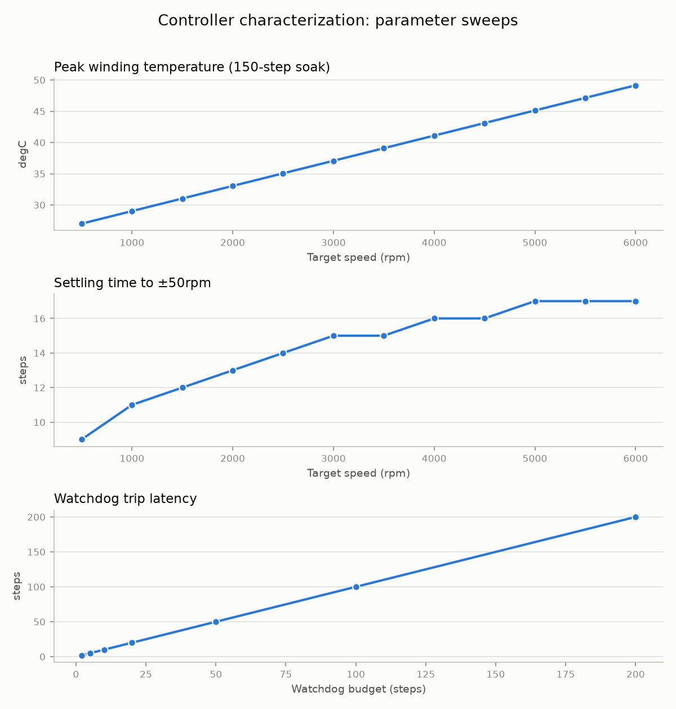

# Embedded Test Automation Framework


HIL-style automated testing for an embedded motor controller: a deterministic simulated device under test (DUT), a transport-abstracted device driver, and a pytest suite covering **protocol conformance**, **closed-loop behavior**, and **fault injection** — with HTML/JUnit reports generated on every push by GitHub Actions.

```
┌────────────────┐     ASCII protocol      ┌──────────────────────┐
│  pytest suite  │──▶ driver ──▶ Transport │  Device under test   │
│  33 tests      │            (swappable)  │  (simulated today,   │
│  4 categories  │◀── responses ◀──────────│   real UART later)   │
└────────────────┘                         └──────────────────────┘
```

## Why this design

- **Transport abstraction is the HIL upgrade path.** Tests talk to a `Transport` interface. Today it binds to an in-process simulator; replacing it with a pyserial implementation runs the *same suite* against real hardware — which is the whole point of hardware-in-the-loop test engineering.
- **Deterministic, step-based physics.** The DUT simulation advances in discrete steps, not wall-clock time: the full suite runs in ~0.1 s, never flakes in CI, and thermal scenarios (overheat trips, stall heating) are exactly reproducible.
- **Faults are latched, like real motor drivers.** Overheat and stall trip a `FAULT` state that stops the motor, rejects speed commands, and survives cooldown until an explicit `RESET` — and the suite verifies exactly that contract.

## Test categories

| File | Covers |
|---|---|
| `tests/test_protocol.py` | Command grammar, range limits (0–6000 rpm boundary-exact), error codes, malformed input |
| `tests/test_control_behavior.py` | Setpoint convergence (<1.7% after settling), monotonic ramp, thermal rise/cooldown |
| `tests/test_fault_injection.py` | Overheat trip, stall-to-overheat cascade, fault latching, command rejection in FAULT, telemetry availability during faults, RESET recovery |
| `tests/test_watchdog.py` | Software watchdog: enable/kick/disable, exact-budget trip, latched fault, RESET recovery, range validation |
| `tests/test_protocol_fuzz.py` | Property-based fuzzing (hypothesis): never-crash contract, state-machine invariants, FAULT-latch invariant, SET_SPEED and watchdog contracts |

## Characterization

Beyond pass/fail, the harness *measures* the controller. `scripts/characterize.py` sweeps parameters over fresh device instances and `scripts/plot_characterization.py` renders the curves:



| Sweep | Result |
|---|---|
| Peak winding temperature vs. target speed | Smooth rise 27 → 49 °C across 500–6000 rpm, well under the 90 °C protection limit |
| Settling time vs. target speed | Monotonic 9 → 17 steps — higher setpoints take longer to reach the ±50 rpm band |
| Watchdog trip latency vs. budget | Exact diagonal (latency = budget) across 2–200 steps — verifies watchdog timing precision |

Property-based fuzzing (`test_protocol_fuzz.py`) runs 200 examples per property against fresh device instances and found **no invariant violations**: the protocol never raises on arbitrary input, and `FAULT` provably never clears except immediately after `RESET`.

## Measurement logging

Behavior and fault tests record real metrics (settling steps, peak temperature, trip latencies) to timestamped CSVs via a session fixture; `scripts/plot_trends.py` charts a metric across runs for regression tracking. See `measurements/sample-run.csv`.

## Run it

```bash
uv run --group dev pytest                  # full suite
uv run --group dev pytest --html=report.html --self-contained-html   # + report
```

(or classic: `pip install pytest && pytest`)

## Roadmap

- [x] pyserial `Transport` (`SerialTransport`) + `loop://` framing tests — HIL upgrade path
- [x] Property-based protocol fuzzing (hypothesis)
- [x] Measurement logging + trend/characterization plots
- [x] Watchdog / communication-timeout test scenarios
- [ ] Hardware profile for a real motor driver board
- [ ] Hypothesis `target()`-guided fault-state coverage

## License

MIT — © 2026 Mo Kamel
