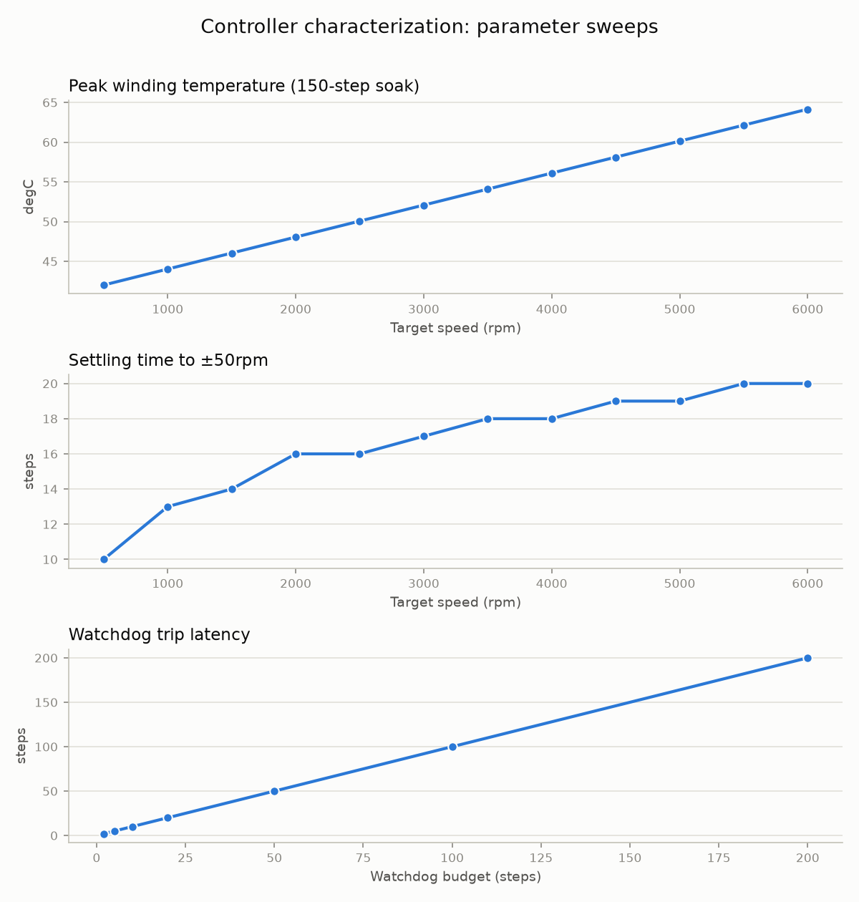

# Embedded Test Automation Framework


HIL-style automated testing for an embedded motor controller: a deterministic simulated device under test (DUT), a transport-abstracted device driver, and a pytest suite covering **protocol conformance**, **closed-loop behavior**, and **fault injection** — with HTML/JUnit reports generated on every push by GitHub Actions.

```
┌────────────────┐     ASCII protocol      ┌──────────────────────┐
│  pytest suite  │──▶ driver ──▶ Transport │  Device under test   │
│  80 tests      │            (swappable)  │  (simulated today,   │
│  100% coverage │◀── responses ◀──────────│   real UART later)   │
└────────────────┘                         └──────────────────────┘
```

## Why this design

- **Transport abstraction is the HIL upgrade path.** Tests talk to a `Transport` interface. Today it binds to an in-process simulator; replacing it with a pyserial implementation runs the *same suite* against real hardware — which is the whole point of hardware-in-the-loop test engineering.
- **Deterministic, step-based physics.** The DUT simulation advances in discrete steps, not wall-clock time: the full suite runs in ~0.1 s, never flakes in CI, and thermal scenarios (overheat trips, stall heating) are exactly reproducible.
- **Faults are latched, like real motor drivers.** Overheat and stall trip a `FAULT` state that stops the motor, rejects speed commands, and survives cooldown until an explicit `RESET` — and the suite verifies exactly that contract.

## Test categories

| File | Covers |
|---|---|
| `tests/test_protocol.py` | Command grammar, range limits (0–6000 rpm boundary-exact), error codes, malformed input |
| `tests/test_control_behavior.py` | Setpoint convergence (<1.7% after settling), monotonic ramp, thermal rise/cooldown |
| `tests/test_fault_injection.py` | Overheat trip, stall-to-overheat cascade, fault latching, command rejection in FAULT, telemetry availability during faults, RESET recovery |
| `tests/test_watchdog.py` | Software watchdog: enable/kick/disable, exact-budget trip, latched fault, RESET recovery, range validation |
| `tests/test_protocol_fuzz.py` | Property-based fuzzing (hypothesis): never-crash contract, state-machine invariants, FAULT-latch invariant, SET_SPEED and watchdog contracts |
| `tests/test_fuzz_efficacy.py` | Fault seeding: three deliberately broken controllers that the property suite must reject |

## The device under test

The DUT is a simulation, but its envelope and protection thresholds are taken
from a real device rather than invented: a **Siemens SIMOTICS S-1FK2**
permanent-magnet synchronous servomotor, article `1FK2105-6AF10-0SA0`, on a
SINAMICS S210 drive. The data sheet is archived in this repo and cited in full
in [`docs/REFERENCES.md`](docs/REFERENCES.md).

| From the data sheet | Value | Used for |
|---|---|---|
| Maximum speed | 6,000 rpm | `SET_SPEED` upper range limit |
| Rated speed / torque | 3,000 rpm / 6.60 Nm | speed dynamics fit |
| Rotor inertia | 3.5 kgcm² | speed dynamics fit |
| Rated / maximum current | 5.6 A / 24.0 A | stall heating scale |
| Thermal class | 155 (F), dT = 100 K at 40 °C ambient | 140 °C overheat trip |

The speed dynamics are **fitted**: at rated torque the torque-limited
acceleration is 6.60 / 3.5e-4 = 18,857 rad/s², so the rotor reaches rated speed
in 16.7 ms, and the first-order constant is chosen to settle in the same time
with 1 step = 1 ms. Only the time is matched, not the shape, since a real servo
under torque limit ramps linearly rather than exponentially.

The thermal dynamics are **not** fitted and cannot be. Siemens does not publish
a thermal time constant, and more fundamentally a 2 kW servo's winding thermal
constant is minutes while its mechanical response is milliseconds. Modelling
both on one step size would need millions of steps to reach a thermal trip. The
thermal time scale is deliberately compressed so a thermal fault is reachable in
a short test, so thermal latencies are in steps only and never in seconds.

## Characterization

Beyond pass/fail, the harness *measures* the controller. `scripts/characterize.py` sweeps parameters over fresh device instances and `scripts/plot_characterization.py` renders the curves:



| Sweep | Result |
|---|---|
| Peak winding temperature vs. target speed | Smooth rise 42.0 to 64.1 °C across 500 to 6000 rpm, well under the 140 °C protection limit |
| Settling time vs. target speed | Monotonic 10 to 20 steps (1 step = 1 ms), higher setpoints take longer to reach the ±50 rpm band |
| Watchdog trip latency vs. budget | Exact diagonal (latency = budget) across 2 to 200 steps, verifying watchdog timing precision |

Property-based fuzzing (`test_protocol_fuzz.py`) runs 200 examples per property against fresh device instances and found **no invariant violations**: the protocol never raises on arbitrary input, and `FAULT` provably never clears except immediately after `RESET`.

## Proving the tests can actually fail

"No defects found" only means something if the suite could have found one. So
three known bugs are seeded into copies of the controller, and
`test_fuzz_efficacy.py` asserts the same properties reject each of them while
still passing on the clean implementation:

| Seeded defect | Minimal input that exposes it |
|---|---|
| A latched `FAULT` cleared by an unknown command instead of only by `RESET` | any unrecognised line |
| `SET_SPEED` boundary written `<= MAX + 1` | `SET_SPEED 6001` |
| Watchdog countdown compared `< 0` instead of `<= 0`, firing one step late | a 1 step budget |

This found a real weakness in the suite. The seeded range defect initially
**survived**: `SET_SPEED` was fuzzed with unbounded floats, and only values in
`(6000, 6001]` expose a one unit boundary error, so the property essentially
never generated one. Both the property and the efficacy search now sample the
neighbourhood of each documented limit, which is boundary value analysis
expressed as a strategy.

## Test design

Techniques are chosen deliberately: equivalence partitioning and boundary value
analysis on the command ranges, state transition testing across
IDLE/RUNNING/FAULT with the FAULT latch rule, fault injection through a test
backdoor, property based testing with a stateful model, and fault seeding to
verify the suite itself. Scope, entry and exit criteria, risk based
prioritisation and the honest limits are in
[`docs/TEST_STRATEGY.md`](docs/TEST_STRATEGY.md).

## Quality gates

CI enforces all of these on Python 3.10 and 3.12, and the build fails on any:

- 80 tests pass
- **100% statement and branch coverage** of the DUT and testbench
  (`--cov-fail-under=100`)
- `ruff check` clean
- `mypy --strict` clean

## Measurement logging

Behavior and fault tests record real metrics (settling steps, peak temperature, trip latencies) to timestamped CSVs via a session fixture; `scripts/plot_trends.py` charts a metric across runs for regression tracking. See `measurements/sample-run.csv`.

## Run it

```bash
uv run --group dev pytest                  # full suite, with coverage
uv run --group dev ruff check .            # lint
uv run --group dev mypy                    # strict type check
uv run --group dev pytest --html=report.html --self-contained-html   # + report
```

(or classic: `pip install pytest && pytest`)

## Roadmap

- [x] pyserial `Transport` (`SerialTransport`) + `loop://` framing tests — HIL upgrade path
- [x] Property-based protocol fuzzing (hypothesis)
- [x] Measurement logging + trend/characterization plots
- [x] Watchdog / communication-timeout test scenarios
- [x] Fault seeding to verify the property suite detects real defects
- [x] Coverage, lint and type-check gates in CI
- [ ] Hardware profile for a real motor driver board
- [ ] Hypothesis `target()`-guided fault-state coverage

## License

MIT — © 2026 Mo Kamel
